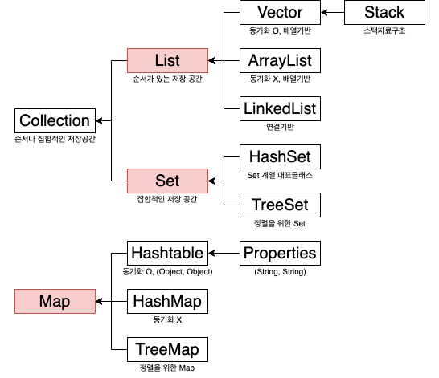

# Chapter 11. 컬렉션 프레임워크 - 2.List, Stack, Queue

교육 과정에서 제공되는 강의 자료(동영상)을 보면서 부족한 내용은 **남궁성님의 Java의 정석 3판**을 추가적으로 읽으며 학습하였습니다.

---

## 컬렉션 프레임웍의 핵심 인터페이스

- 컬렉션(collection) : 여러 객체(데이터)를 모아 놓은 것
- 프레임웍(framework) : 표준화, 정형화된 체계적인 프로그래밍 방식
- 컬렉션 프레임웍(collections framework)
  - 컬렉션(다수의 객체, 데이터 군)을 다루기 위한 표준화된 프로그래밍 방식(설계)
  - 컬렉션을 쉽고 편리하게 다룰 수 있는 다양한 클래스를 제공
  - 프로그램 구현에 필요한 자료구조와 알고리즘을 구현해 놓은 라이브러리
  - 개발에 소요되는 시간을 절약하고 최적화된 라이브러리를 사용할 수 있음
  - `java.util` 패키지에 포함. JDK1.2부터 제공
- 컬렉션 클래스(collection class) : 다수의 데이터를 저장할 수 있는 클래스
  ex) `Vector`, `ArrayList`, `HashSet` ...
- 컬렉션 프레임웍에서는 컬렉션 데이터 그룹을 크게 3가지 타입(`List`, `Set`, `Map`)이 존재한다고 인식
  
  1. `List`
     - 순서O 중복O. 예) 대기자 명단
     - 객체를 순서에 따라 저장하고 관리하는데 필요한 메서드가 선언된 인터페이스
     - 배열의 기능을 구현하기 위한 메서드가 선언됨
     - 구현 클래스 : `ArrayList`, `LinkedList`, `Stack`, `Vector` 등
  2. `Set`
     - 순서X 중복 X. 예) 네발 동물의 집합
     - 구현 클래스 : `HashSet`, `TreeSet` 등
  3. `Map`
     - 키(key)와 값(value)의 쌍(entry, pair)으로 이루어진 데이터 집합.
     - 순서X, 키-중복X, 값-중복O. 예) 지역번호(전화번호. 02: 서울, 031: 경기)
     - 구현 클래스 : `HashMap`, `TreeMap`, `Hashtable`, `Properties` 등
- `Collection` 인터페이스의 메서드
  - 추가 : `add`, `addAll`
  - 삭제 : `clear`, `remove`, `removeAll`, `retainAll`
  - 검색 : `contains`, `containsAll`, `isEmpty`
  - 변환 : `toArray`
  - 기타 : `equals`, `hashCode`, `iterator`, `size`
- 자료구조(data structure)
  - `hash` : 검색을 위한 자료구조
    - `hash(key)` : 해당 데이터의 주소(index)를 반환.
    - 산술연산이라 굉장히 빠름 → 검색에 최적화
  - `binary tree` : 모든 노드가 최대 2개의 하위 노드를 갖는 트리구조.
    - BST(binary search tree) : 검색을 위한 이진트리.
      - 부모보다 작은 값을 left node에, 큰 값을 right node에 배치한다.
      - 데이터가 많아질 수록 추가, 삭제에 시간이 더 걸림(비교 횟수 증가. 루트부터 비교 시작)
      - 검색(범위검색)과 정렬에 유리하다.
      - 중복된 값을 저장하지 못한다.
    - 트리 순회(tree traversal)
      - 이진 트리의 모든 노드를 한번씩 읽는 것을 트리순회라고 한다.
      - 전위순회(preorder), 후위순회(postorder), 중위순회(inorder), 레벨순회
      - 중위 순회하면 오름차순으로 정렬된다.

## ArrayList

- 자바에서 제공되는 객체 배열이 구현된 클래스. 객체 배열을 사용하는데 필요한 여러 메서드들이 구현.
- `List`인터페이스를 구현하므로, 저장순서가 유지되고 중복을 허용한다.
- `ArrayList`는 기존의 `Vector`를 개선한 것으로 구현원리와 기능적으로 동일(가능하면 `Vector`보다는 `ArrayList` 사용)
  `ArrayList` 와 달리 `Vector` 는 자체적으로 동기화(synchronization. 두 개의 쓰레드가 동시에 하나의 리소스에 접근할 때 순서를 맞추어서 데이터의 오류를 방지) 처리가 되어 있다.
- 데이터의 저장공간으로 배열을 사용한다. (배열기반) → 논리적 순서와 물리적 순서가 동일
- `ArrayList`를 생성할 때, 저장할 요소의 개수를 고려해서 실제 저장할 개수보다 약간 여유있는 크기로 하는 것이 좋다. → 지정한 크기보다 더 많은 객체를 저장하면 자동적으로 크기가 늘어나기는 하지만 이 과정에서 처리시간이 많이 소요되기 때문
- `ArrayList` 의 메서드
  - `ArrayList()` : 기본 생성자. 크기가 10인 `ArrayList` 생성
  - `ArrayList(Collection c)` : 주어진 컬렉션이 저장된 `ArrayList` 생성
  - `ArrayList(int initialCapacity)` : 지정된 초기용량을 갖는 `ArrayList` 생성
  - `boolean add(Object o)` : `ArrayList`의 마지막에 객체를 추가. 성공하면 `true` 리턴.
  - `void add(int index, Object element)` : 지정된 위치(index)에 객체를 저장
  - `boolean addAll(Collection c)` : 주어진 컬렉션의 모든 객체를 저장
  - `boolean addAll(int index, Collection c)` : 지정된 위치부터 주어진 컬렉션의 모든 객체 저장
  - `boolean remove(Object o)` : 지정한 객체를 제거. 성공하면 `true`, 실패하면 `false` 리턴.
  - `Object remove(int index)` : 지정된 위치(index)에 있는 객체를 제거
  - `boolean removeAll(Collection c)` : 지정한 컬렉션에 저장된 것과 동일한 객체들을 `ArrayList`에서 제거
  - `boolean retainAll(Collection c)` : `ArrayList`에 저장된 객체 중에서 주어진 컬렉션과 공통된 것들만을 남기고 나머지는 삭제
  - `void clear()` : `ArrayList`를 완전히 비운다.
  - `int indexOf(Object o)` : 지정된 객체가 저장된 위치를 찾아 반환
  - `int lastIndexOf(Object o)` : 객체(o)가 저장된 위치를 끝부터 역방향으로 검색해서 반환
  - `boolean contains(Object o)` : 지정된 객체가 `ArrayList`에 포함되어 있는지 확인
  - `Object get(int index)` : 지정된 위치(index)에 저장된 객체 반환
  - `Object set(int index, Object element)` : 주어진 객체를 지정된 위치에 저장
  - `List subList(int fromIndex, int toIndex)` : `fromIndex`부터 `toIndex`사이에 저장된 객체 반환(읽기 전용)
  - `Object[] toArray()` : `ArrayList`에 저장된 모든 객체들을 객체배열로 반환
  - `Object[] toArray(Object[] a)` : `ArrayList`에 저장된 모든 객체들을 객체배열 a에 담아 반환
  - `boolean isEmpty()` : `ArrayList`가 비어있는지 확인
  - `void trimToSize()` : 용량을 크기에 맞게 줄인다.(빈 공간 제거)
  - `int size()` : `ArrayList`에 저장된 객체의 개수 반환

## LinkedList

- 배열의 장단점
  - 장점 : 배열은 구조가 간단하고 데이터를 읽는 데 걸리는 시간(접근시간, access time)이 짧다.
  - 단점
    - 크기를 변경할 수 없다.
      - 크기를 변경하는 경우 새로운 1)배열을 생성 후 2)데이터를 복사하고 3)참조를 변경해야 함.
      - 크기 변경을 피하기 위해 큰 배열을 생성하면, 메모리가 낭비됨. (비효율적인 메모리 사용)
    - 비순차적인 데이터의 추가, 삭제에 시간이 많이 걸린다.
      - 데이터를 추가하거나 삭제하기 위해, 다른 데이터를 옮겨야 함.
      - 그러나 순차적인 데이터 추가(끝에 추가)와 삭제(끝부터 삭제)는 빠르다
- 연결리스트(linked list) - 배열의 단점을 보완. 배열과 달리 불연속적으로 존재하는 데이터를 연결(link)
  ```java
  Class Node {
  	Node next; // 다음 요소의 주소를 저장
  	Object obj; // 데이터를 저장
  }
  ```
  - 데이터의 삭제 : 단 한 번의 참조 변경만으로 가능
  - 데이터의 추가 : 한번의 `Node` 객체 생성과 두 번의 참조 변경만으로 가능
  - 논리적으로 순차적인 구조이지만, 물리적으로는 순차적이지 않을 수 있음
- 이중 연결리스트(doubly linked list) - 데이터 접근성(accessability)이 나쁘다는 연결리스트의 단점 보완
  ```java
  class Node {
  	Node next; // 다음 요소의 주소를 저장
  	Node previous; // 이전 요소의 주소를 저장
  	Object obj; // 데이터를 저장
  }
  ```
  - 링크드 리스트보다 각 요소에 대한 접근과 이동이 쉽기 때문에 링크드 리스트보다 더 많이 사용된다.
  - `LinkedList` 클래스는 실제로 더블 링크드 리스트로 구현.
- 이중 원형 연결리스트(doubly circular linked list) - 더블 링크드 리스트의 첫 번째 요소와 마지막 요소를 서로 연결시켜 접근성을 보다 향상시킴

## Stack & Queue

- 스택(stack) : LIFO(Last In First Out). 양 옆과 바닥이 막혀 있어서 한 방향으로만 뺄 수 있는 구조
  - 저장 : `push`
  - 추출 : `pop`
  - `ArrayList`를 사용하여 구현하는 것이 적합(순차적 추가/삭제)
  - 활용 예 : 수식계산, 수식괄호검사, 워드프로세서의 undo/redo, 웹브라우저의 뒤로/앞으로
- 큐(queue) : FIFO(First In First Out). 양 옆만 막혀있고 위아래로 뚫려 있어서 한 방향으로는 넣고 한 방향으로 빼는 파이프와 같은 구조
  - 저장 : `offer`
  - 추출 : `poll`
  - `LinkedList`를 사용하여 구현하는 것이 적합(항상 첫 번째 저장된 데이터를 삭제하므로, 배열기반의 컬렉션 클래스를 사용한다면 데이터를 꺼낼 때마다 복사가 발생)
  - 활용 예 : 최근사용문서, 인쇄작업 대기목록, 버퍼(buffer)
  - `PriorityQueue`
    - `Queue` 인터페이스 구현체 중의 하나로, 저장한 순서에 관계 없이 우선순위(priority)가 높은 것부터 꺼내게 된다
    - `null`은 저장할 수 없으며, `null`을 저장하면 `NullPointException`이 발생한다.
    - 저장공간으로 배열을 사용하며, 각 요소를 `heap`의 자료구조 형태로 저장한다.
  - `Deque` (Double-Ended Queue. 덱 또는 디큐라고 읽음)
    - `Queue`의 변형으로, 양쪽 끝에 추가/삭제가 가능하다.
    - `Deque`의 조상은 `Queue`이며, 구현체로는 `ArrayDeque`와 `LinkedList` 등이 있다.
    - 스택과 큐를 하나로 합쳐놓은 것과 같으며 스택으로 사용할 수도 있고, 큐로 사용할 수도 있다.

---

## Reference

남궁성, 『Java의 정석 3판』, 도우출판(2016), p578-613(Chapter 12 - 컬렉션 프레임웍 中).
