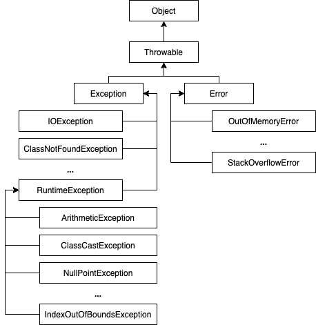

# Chapter 13. 예외 처리

교육 과정에서 제공되는 강의 자료(동영상)을 보면서 부족한 내용은 **남궁성님의 Java의 정석 3판**을 추가적으로 읽으며 학습하였습니다.

---

## 프로그램 오류

- 컴파일 에러(compile-time error) : 컴파일 할 때 발생하는 에러
  - 프로그램 코드 작성 중 발생하는 문법적 오류
- 런타임 에러(runtime error) : 실행 시에 발생하는 에러
  - 실행 중인 프로그램이 중지되는 오류
  - 자바에서는 실행 시 발생할 수 있는 프로그램 오류를 두 가지로 구분하였다.
  - 에러(error) : 프로그램 코드에 의해서 수습될 수 없는 심각한 오류
    - 가상머신에서 발생, 프로그래머가 처리할 수 없음
    - ex) 메모리 부족(OutOfMemoryError), 스택오버플로우(StackOverflowError)
  - 예외(exception) : 프로그램 코드에 의해서 수습될 수 있는 다소 미약한 오류
- 논리적 에러(logical error) : 실행은 되지만, 의도와 다르게 동작하는 것(bug)

## 예외 클래스의 계층구조



- `Exception` 클래스들 : 사용자의 실수와 같은 외적인 요인에 의해 발생하는 예외
  - checked 예외 : 컴파일러가 예외 처리 여부를 체크(예외 처리 필수)
- `RuntimeException` 클래스들 : 프로그래머의 실수로 발생하는 예외
  - unchecked 예외 : 컴파일러가 예외 처리 여부를 체크 안함(예외 처리 선택)

## 예외처리 - `try-catch`

- 정의 : 프로그램 실행 시 발생할 수 있는 예외의 발생에 대비한 코드를 작성하는 것
- 목적 : 프로그램의 비정상 종료를 막고, 정상적인 실행상태를 유지하는 것
- 예외를 처리하기 위해서는 `try-catch`문을 사용한다.
  ```java
  try {
  	// 예외가 발생할 가능성이 있는 문장들을 넣는다.
  } catch (Exception1 e1) {
  	// Exception1이 발생했을 경우, 이를 처리하기 위한 문장을 적는다.
  } catch (Exception2 e2) {
  	// Exception2이 발생했을 경우, 이를 처리하기 위한 문장을 적는다.
  } catch (ExceptionN eN) {
  	// ExceptionN이 발생했을 경우, 이를 처리하기 위한 문장을 적는다.
  }
  ```
  - `try`블럭 내에서 예외가 발생한 경우,
    - 발생한 예외와 일치하는 `catch`블럭이 있는지 확인
    - 일치하는 `catch`블럭을 찾게 되면, 그 `catch`블럭 내의 문장들을 수행하고 전체 `try-catch`문을 빠져나가서 그 다음 문장을 계속해서 수행.
    - 일치하는 `catch`블럭을 찾지 못하면, 예외는 처리되지 못함
  - `try`블럭 내에서 예외가 발생하지 않은 경우,
    - `catch`블럭을 거치지 않고 전체 `try-catch`문을 빠져나가서 수행을 계속함
  - `if`문과 달리 블럭 내에 포함된 문장이 하나뿐이어도 괄호{}를 생략할 수 없다.
  - 모든 예외 클래스는 `Exception`클래스의 자손이므로, `catch`블럭의 괄호()에 `Exception` 타입의 참조변수를 선언하면 어떤 종류의 예외가 발생하더라도 이 `catch`블럭에 의해 처리된다.
- `printStackTrace()` : 예외발생 당시의 호출스택(Call Stack)에 있었던 메서드의 정보와 예외 메시지를 화면에 출력한다.
- `getMessage()` : 발생한 예외클래스의 인스턴스에 저장된 메시지를 얻을 수 있다.
- JDK1.7부터 멀티 `catch`블럭 사용 가능
  ```java
  try {
  	...
  } catch (ExceptionA | ExceptionB e) {
  	e.printStackTrace();
  }
  ```

## 예외 발생시키기 - `throw`

1. 연산자 `new`를 이용해서 발생시키려는 예외 클래스의 객체를 만든 다음

   ```java
   Exception e = new Exception("고의로 발생시킨 에러!");
   ```

   - `Exception` 인스턴스를 생성할 때, 생성자에 `String`을 넣어주면, 이 문자열이 인스턴스에 메시지로 저장되며, 이 메시지는 `getMessage()` 메서드를 이용해서 얻을 수 있다.

2. 키워드 `throw`를 이용해서 예외를 발생시킨다.

   ```java
   throw e;
   ```

## 예외처리(떠넘기기, 미루기) - 메서드에 예외 선언하기

```java
void method() throws Exception1, Exception2, ... ExceptionN {
	// 메서드의 내용
}
```

- 메서드가 호출시 발생가능한 예외를 호출하는 쪽에 알리는 것
  - 일반적으로 `RuntimeException` 클래스들은 적지 않으며, 보통은 반드시 처리해주어야 하는 예외(checked 예외)만 선언한다.
- 사실 예외를 메서드의 `throws`에 명시하는 것은 엄밀히 예외를 처리하는 것이 아니라, 자신(예외가 발생할 가능성이 있는 메서드)을 호출한 메서드에게 예외를 전달하여 예외처리를 떠맡기는 것이다.
- 메서드를 사용하는 쪽에서는 이에 대한 처리를 하도록 강요하기 때문에, 보다 견고한 프로그램 코드를 작성할 수 있다.
- 예외를 발생시키는 키워드 `throw`와 예외를 메서드에 선언할 때 쓰이는 `throws` 구분에 주의
- `main()`에서 `throws`를 사용하면 가상머신에서 처리 됨

## `finally` 블럭

```java
try {
	// 예외가 발생할 가능성이 있는 문장들을 넣는다.
} catch (Exception e) {
	// 예외처리를 위한 문장을 적는다.
} finally {
	// 예외의 발생여부와 관계없이 항상 수행되어야하는 문장들을 넣는다.
	// finally블럭은 try-catch문의 맨 마지막에 위치해야한다.
}
```

- 예외 발생여부와 관계없이 수행되어야 하는 코드를 넣는다.
- 리소스를 정리하는 코드를 주로 쓴다.
- 예외가 발생한 경우에는 try→catch→finally 순으로 실행되고, 예외가 발생하지 않은 경우에는 try→finally 순으로 실행된다.
- `try` 블럭이나 `catch` 블럭에서 `return`문이 수행되는 경우에도, `finally` 블럭의 문장들이 먼저 실행된 후에, 실행중인 메서드가 종료된다.
- `finally` 블럭 내에도 `return`문을 사용할 수 있으며, `try` 블럭이나 `catch` 블럭의 `return`문 다음에 수행된다. 최종적으로 `finally` 블럭 내의 `return`문 반환값이 반환된다.

## 자동 자원 반환 - `try-with-resources`

- 리소스를 자동으로 해제 하도록 제공해주는 구문(JDK1.7부터 추가)
- `try-with-resources`문의 괄호() 안에 객체를 생성하는 문장을 넣으면, 해당 리소스가 `AutoCloseable`을 구현한 경우 `close()`를 명시적으로 호출하지 않아도, `try{}`를 벗어나는 순간 자동적으로 `close()`가 호출된다.
- JDK1.9이후부터 향상된 `try-with-resources`문을 사용해, 외부에서 선언한 참조변수를 그대로 쓸 수 있다.

## 사용자 정의 예외 만들기

```java
class MyException extends Exception {
	private final int ERR_CODE;

	MyException(String msg, int errCode) {
		super(msg);
		ERR_CODE = errCode;
	}

	MyException(String msg) {
		this(msg, 100);
	}

	public int getErrCode() {
		return ERR_CODE;
	}
}
```

- 기존의 정의된 클래스 외에 필요에 따라 새로운 예외 클래스를 정의할 수 있다.
- 보통 `Exception`과 `RuntimeException`로부터 상속받아 클래스를 만들지만, 필요에 따라서 알맞은 예외 클래스를 선택할 수 있다.
  - 요즘은 예외처리를 선택적으로 할 수 있도록 `RuntimeException`을 상속받아 처리하는 추세

## 예외 되던지기(exception re-throwing)

- 예외를 처리한 후에 다시 예외를 발생시키는 것
- 예외가 발생한 메서드와 이를 호출한 메서드 양쪽 모두에서 처리해줘야할 작업이 있을 때 사용
- 예외가 발생할 메서드에서는 `try-catch`문을 사용해서 예외처리를 해줌과 동시에 메서드 선언부에 발생할 예외를 `throws`에 지정해주어야 함에 주의

## 연결된 예외(chained exception)

```java
try {
	startInstall(); // SpaceException(저장공간부족) 발생
	copyFiles();
} catch (SpaceException e) {
	InstallException ie = new InstallException("설치중 예외발생");
	ie.initCause(e);
	throw ie;
}
```

- 한 예외가 다른 예외를 발생시킬 수 있다.
- 예외 A가 예외 B를 발생시키면, A는 B의 원인 예외(cause exception)
- `Throwable initCause(Throwable cause)` : 지정한 예외를 원인 예외로 등록
- `Throwable getCase()` : 원인 예외를 반환
- 사용하는 이유
  - 여러 예외를 하나의 큰 분류의 예외로 묶어서 다루기 위해서
  - checked 예외를 unchecked 예외로 바꾸기 위해서
    - `initCause()` 대신 `RuntimeException`의 생성자 사용

---

## Reference

남궁성, 『Java의 정석 3판』, 도우출판(2016), p414-447(Chapter 08 - 예외 처리 exception handling).
